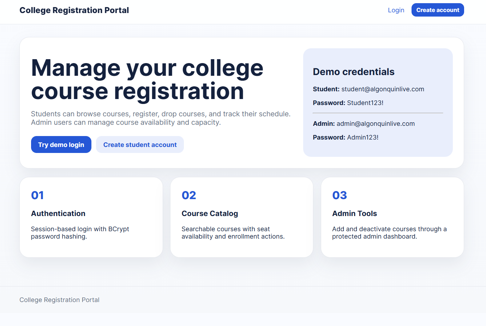
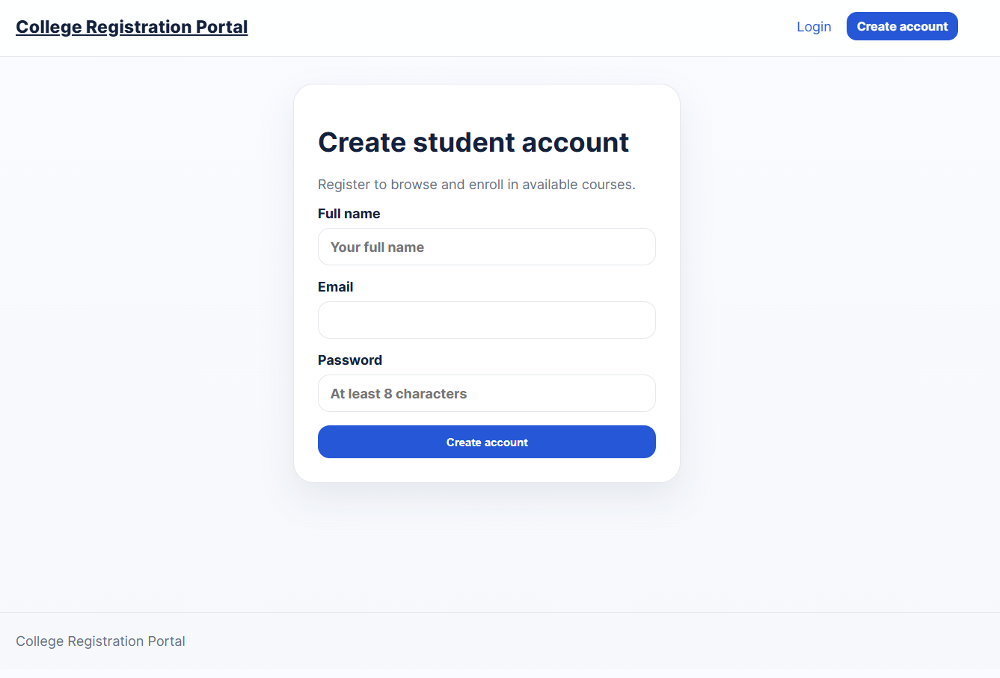
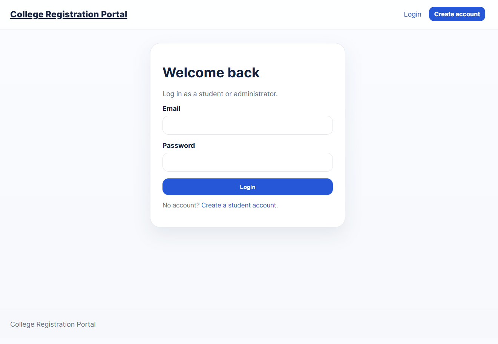
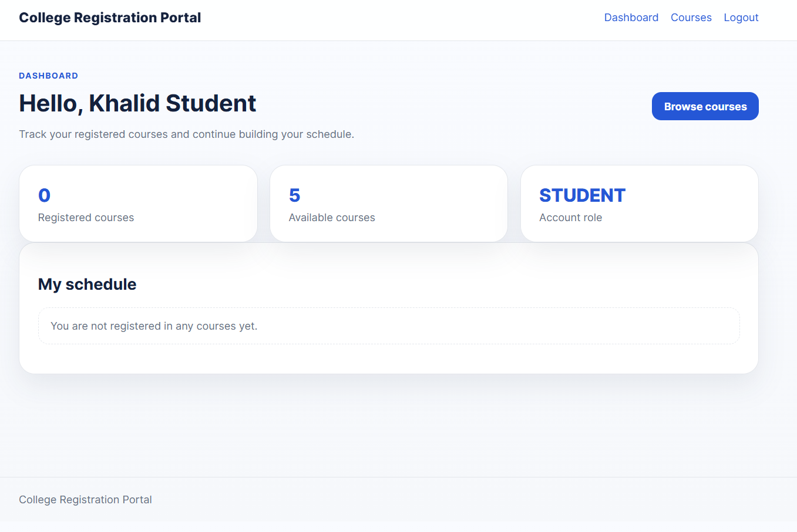
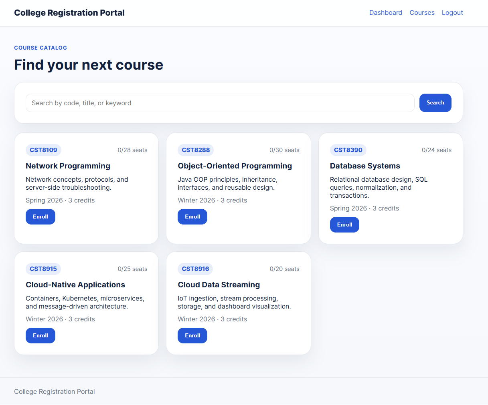
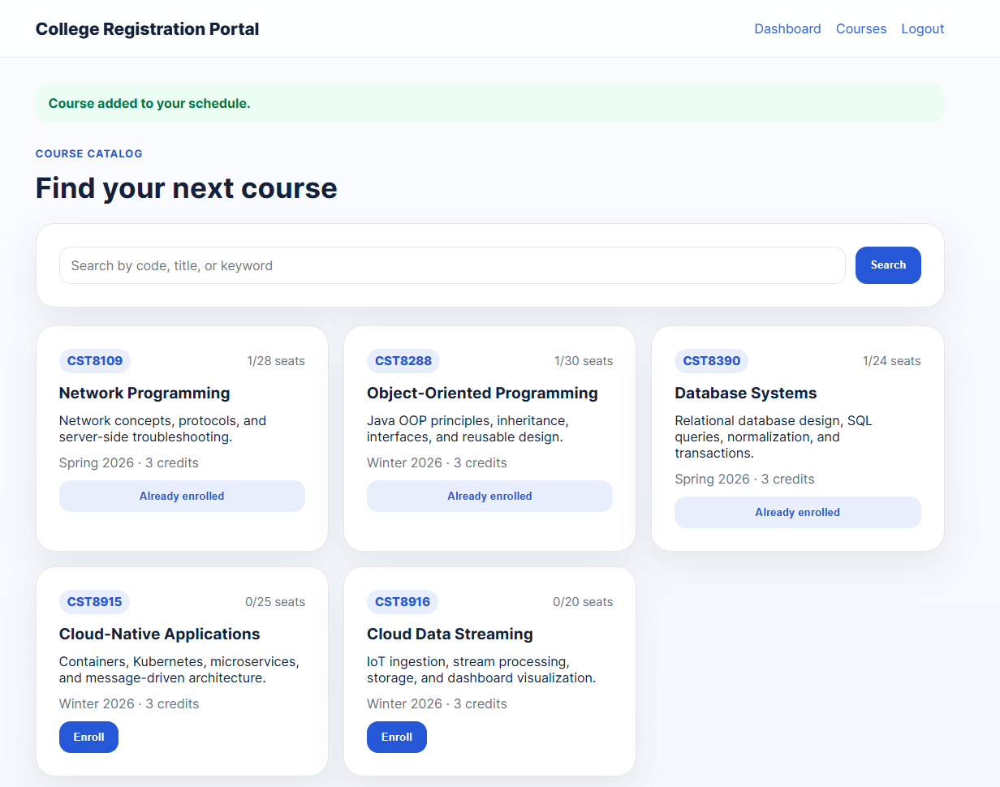
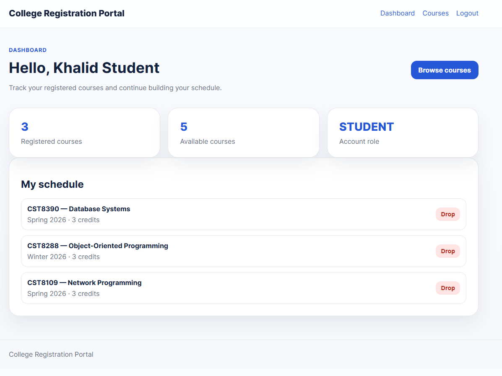
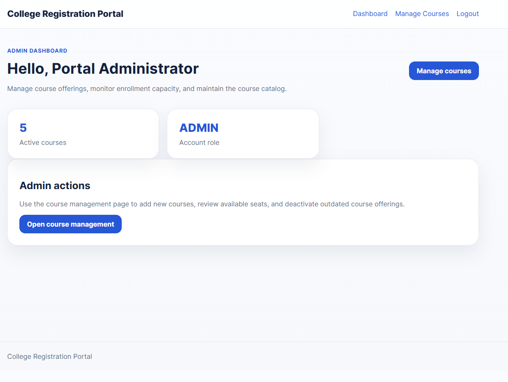
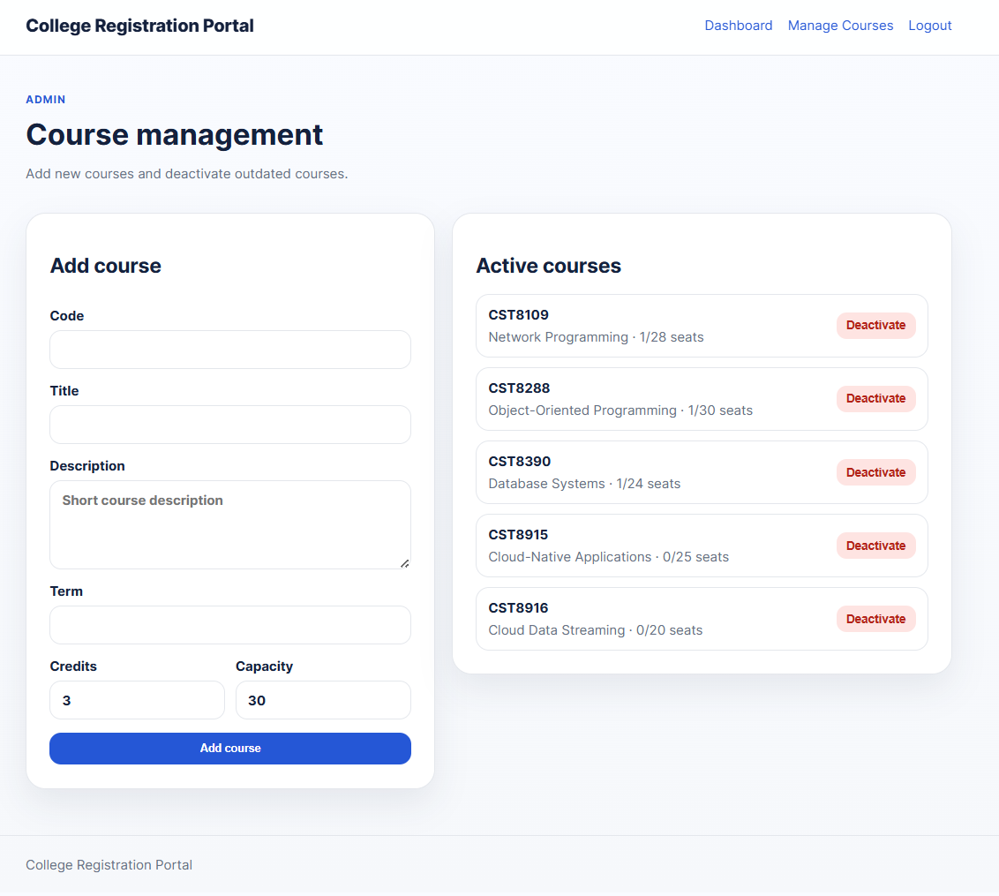
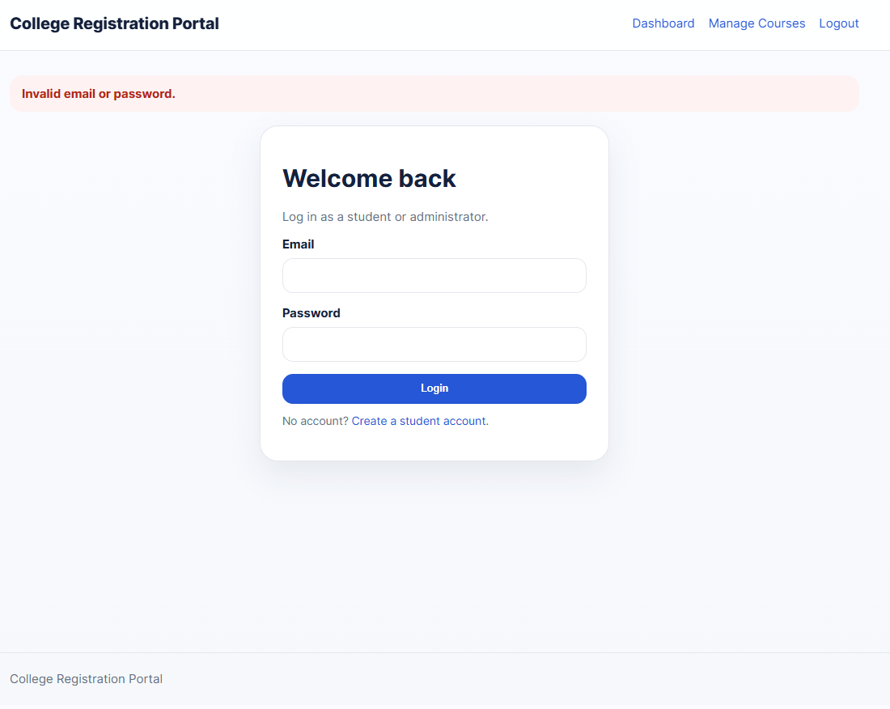

# College Registration Portal

This Java web application simulates a college course registration system. The project demonstrates Servlet/JSP development, MVC-style layering, authentication, role-based access, course catalog browsing and enrollment management.

This project shows Java backend development, HTTP request handling, JSP views, session management, service/repository separation, password hashing, basic validation, and a clean user interface.

## Features

- Student and admin login
- BCrypt password hashing
- Session-based authentication
- Role-based access control
- Student dashboard with registered courses
- Course catalog with search/filter UI
- Course enrollment and drop actions
- Seat capacity tracking
- Admin dashboard for course management
- Modern responsive UI
- In-memory demo data for easy local testing
- SQL schema included for future MySQL persistence

## Demo users

| Role | Email | Password |
|---|---|---|
| Student | student@algonquinlive.com | Student123! |
| Admin | admin@algonquinlive.com | Admin123! |

## Tech stack

- Java 17
- Jakarta Servlets 6
- JSP / JSTL
- Maven WAR packaging
- BCrypt
- HTML, CSS, JavaScript
- Optional MySQL schema included
- JUnit 5

## Project structure

```text
src/main/java/ca/algonquin/portal
├── controller     # Servlets: HTTP request handling
├── filter         # Authentication and role protection
├── model          # Domain objects: User, Course, Enrollment
├── repository     # Data access abstraction and in-memory implementation
├── service        # Business logic
└── util           # Shared helpers

src/main/webapp
├── WEB-INF/views  # JSP pages protected from direct access
└── assets         # CSS and JavaScript
```

## How to run locally

1. Install Java 17, Maven, and Apache Tomcat 10+.
2. Clone the repository.
3. Build the WAR file:

```bash
mvn clean package
```

4. Deploy `target/college-registration-portal.war` to Tomcat 10+.
5. Open the application in your browser:

```text
http://localhost:8080/college-registration-portal
```

## Database notes

The current version uses an in-memory repository so the app is easy to demonstrate without external setup. A MySQL schema is included under `database/schema.sql` for future database persistence.

## Screenshots

This section presents the main pages and features of the College Registration Portal.

---

### 1. Home Page

The home page introduces the application and provides navigation to the login and registration pages.



---

### 2. Student Registration Page

The registration page allows new students to create an account by entering their personal information and login credentials.



---

### 3. Login Page

The login page allows existing students and administrators to access the portal securely.



---

### 4. Student Dashboard

The student dashboard gives students access to available courses, current enrollments, and account-related actions.



---

### 5. Course Catalog

The course catalog displays available courses with details such as course code, title, description, credits, and capacity.



---

### 6. Course Enrollment

Students can enroll in available courses directly from the course catalog.



---

### 7. My Enrollments Page

This page shows the courses in which the student is currently enrolled and provides the option to drop a course.



---

### 8. Admin Dashboard

The admin dashboard provides access to course management features for users with administrator privileges.



---

### 9. Manage Courses Page

Administrators can add, edit, or manage course information from this page.



---

### 10. Error / Validation Messages

The application displays user-friendly messages when login fails, required fields are missing, or an action cannot be completed.


